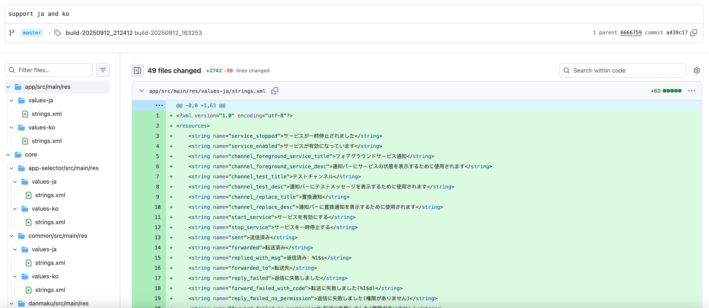
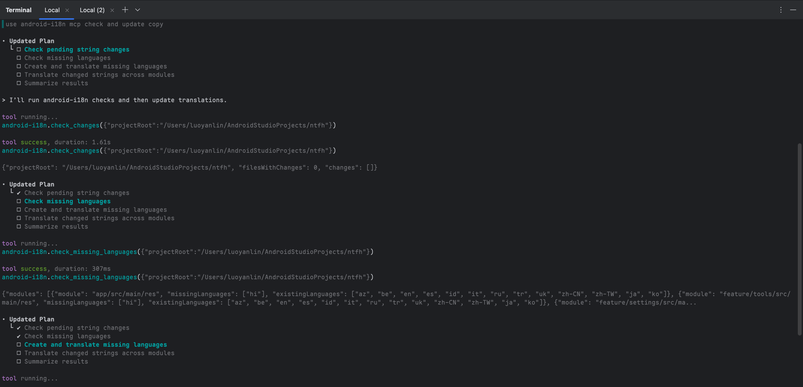

# Android i18n MCP 服务器

<div align="right">
  <a href="https://github.com/realskyrin/android-i18n-mcp/blob/main/README.md">English</a> | 
  <a href="https://github.com/realskyrin/android-i18n-mcp/blob/main/README-ZH.md">中文</a>
</div>

一个 MCP (Model Context Protocol) 服务器，通过使用 Git diff 检测默认 `strings.xml` 文件的变化，自动将 Android 应用字符串资源翻译成多种语言。

📖 [项目介绍文章](https://juejin.cn/post/7549032025673662514)

## 截图

<div align="center">
  
  <p><em>一次性生成多种语言文件，大规模批量翻译，显著提高效率</em></p>
</div>

<div align="center">
  
  <p><em>MCP 工具自动检测并翻译缺失的语言</em></p>
</div>

## 功能特性

- 使用 Git diff 自动检测默认 `strings.xml` 文件中新增或修改的字符串
- 支持翻译至多达 28 种语言（可通过环境变量配置）
- 保留 Android 字符串格式化占位符（%s、%d、%1$s 等）
- 支持多个 Android 模块
- 批量翻译以提高性能
- 仅翻译更改的字符串以节省 API 成本
- 可配置语言选择以优化 API 使用

## 支持的语言

服务器支持翻译至 28 种语言。您可以使用 `TRANSLATION_LANGUAGES` 环境变量配置要翻译的语言。

### 所有支持的语言：

- `zh-CN` - 简体中文 (values-zh-rCN)
- `zh-TW` - 繁体中文台湾 (values-zh-rTW)
- `zh-SG` - 繁体中文新加坡 (values-zh-rSG)
- `zh-HK` - 繁体中文香港 (values-zh-rHK)
- `zh-MO` - 繁体中文澳门 (values-zh-rMO)
- `en` - 英语 (values-en)
- `es` - 西班牙语 (values-es)
- `hi` - 印地语 (values-hi)
- `fr` - 法语 (values-fr)
- `ar` - 阿拉伯语 (values-ar)
- `bn` - 孟加拉语 (values-bn)
- `pt` - 葡萄牙语 (values-pt)
- `ru` - 俄语 (values-ru)
- `ur` - 乌尔都语 (values-ur)
- `id` - 印尼语 (values-id)
- `de` - 德语 (values-de)
- `ja` - 日语 (values-ja)
- `sw` - 斯瓦希里语 (values-sw)
- `mr` - 马拉地语 (values-mr)
- `te` - 泰卢固语 (values-te)
- `tr` - 土耳其语 (values-tr)
- `ko` - 韩语 (values-ko)
- `ta` - 泰米尔语 (values-ta)
- `vi` - 越南语 (values-vi)
- `az` - 阿塞拜疆语 (values-az)
- `be` - 白俄罗斯语 (values-be)
- `it` - 意大利语 (values-it)
- `uk` - 乌克兰语 (values-uk)

## 安装

1. 克隆仓库：
```bash
git clone <repository-url>
cd android-i18n-mcp
```

2. 安装依赖：
```bash
npm install
```

3. 构建项目：
```bash
npm run build
```

4. 配置环境变量：
```bash
cp .env.example .env
```

编辑 `.env` 文件配置：
```env
ANDROID_PROJECT_ROOT=/path/to/your/android/project
TRANSLATION_PROVIDER=openai
TRANSLATION_API_KEY=your_api_key_here
# 可选：
TRANSLATION_API_BASE_URL=https://api.openai.com/v1
TRANSLATION_MODEL=gpt-4o-mini
# 逗号分隔的语言列表（可选，默认为所有 28 种语言）
TRANSLATION_LANGUAGES=zh-CN,es,fr,de,ja,ko
```

## MCP 配置

### 将此服务器添加到您的 MCP 客户端配置（例如 Cursor 或 Claude Desktop）：

```json
{
  "mcpServers": {
    "android-i18n": {
      "command": "node",
      "args": ["/path/to/android-i18n-mcp/build/index.js"],
      "env": {
        "ANDROID_PROJECT_ROOT": "/path/to/your/android/project",
        "TRANSLATION_PROVIDER": "openai",
        "TRANSLATION_API_BASE_URL": "https://api.deepseek.com/v1",
        "TRANSLATION_API_KEY": "your_api_key_here",
        "TRANSLATION_LANGUAGES": "zh-CN,es,fr,de"  // 可选：指定语言
      }
    }
  }
}
```

### Codx 配置示例

在您的 `codx.toml` 中添加以下配置：

```toml
[mcp_servers.android-i18n]
command = "node"
args = ["/path/to/android-i18n-mcp/build/index.js"]

[mcp_servers.android-i18n.env]
ANDROID_PROJECT_ROOT = "/path/to/android/project"
TRANSLATION_PROVIDER = "deepseek"
TRANSLATION_API_BASE_URL = "https://api.deepseek.com/v1"
TRANSLATION_API_KEY = "sk-xxxxxx"
TRANSLATION_MODEL = "deepseek-chat"
TRANSLATION_LANGUAGES = "zh-CN,es,fr,de,ja,ko"  # 可选：指定语言，如果项目中不存在则会自动新增并翻译
```

## Agent Instruction

您可以配置 AGENTS.md 或 CLAUDE.md 来让 Agent 在修改了 strings.xml 文件时自动调用 MCP：

```markdown
## Copy res update Guidelines
- Whenever a strings.xml file is modified, run android-i18n mcp to check and update copy.
```

## 可用工具

### 1. `translate_all_modules`
检测所有模块中默认 strings.xml 文件的变化，并将其翻译成所有支持的语言。

**参数：**
- `projectRoot`（可选）：Android 项目根目录。如未提供，使用 `ANDROID_PROJECT_ROOT` 环境变量。

**示例：**
```json
{
  "tool": "translate_all_modules",
  "arguments": {
    "projectRoot": "/path/to/android/project"
  }
}
```

### 2. `translate_module`
检测特定模块默认 strings.xml 的变化并翻译成所有语言。

**参数：**
- `modulePath`（必需）：Android 模块目录路径

**示例：**
```json
{
  "tool": "translate_module",
  "arguments": {
    "modulePath": "/path/to/android/project/app"
  }
}
```

### 3. `check_changes`
检查默认 strings.xml 文件中未提交的更改，而不执行翻译。

**参数：**
- `projectRoot`（可选）：Android 项目根目录

**示例：**
```json
{
  "tool": "check_changes",
  "arguments": {
    "projectRoot": "/path/to/android/project"
  }
}
```

### 4. `check_missing_languages`
检查与配置的 TRANSLATION_LANGUAGES 环境变量相比缺少哪些语言目录。

**参数：**
- `projectRoot`（可选）：Android 项目根目录

**示例：**
```json
{
  "tool": "check_missing_languages",
  "arguments": {
    "projectRoot": "/path/to/android/project"
  }
}
```

### 5. `create_and_translate_missing_languages`
为所有配置的语言创建缺失的语言目录，并将默认的 strings.xml 翻译到这些目录中。

**参数：**
- `projectRoot`（可选）：Android 项目根目录

**示例：**
```json
{
  "tool": "create_and_translate_missing_languages",
  "arguments": {
    "projectRoot": "/path/to/android/project"
  }
}
```

## 工作原理

1. **变化检测**：服务器使用 Git diff 检测自上次提交以来默认 `values/strings.xml` 文件中添加或修改了哪些字符串。

2. **批量翻译**：使用配置的 AI 翻译 API 将更改的字符串批量翻译成目标语言。

3. **XML 合并**：翻译后的字符串合并到现有的特定语言 `strings.xml` 文件中，保留现有翻译，仅更新更改的部分。

4. **模块支持**：服务器可以在单个操作中处理多个 Android 模块，检测所有匹配模式 `**/src/main/res/values/strings.xml` 的文件。

## 翻译提供商

当前支持：
- **OpenAI**（包括 OpenAI 兼容的 API）
- **DeepSeek**（自动使用 api.deepseek.com 端点）

计划支持：
- Anthropic Claude
- Google Translate

### DeepSeek 配置示例：
```env
TRANSLATION_PROVIDER=deepseek
TRANSLATION_API_KEY=your_deepseek_api_key
# 可选：默认为 deepseek-chat
TRANSLATION_MODEL=deepseek-chat
# 可选：要翻译的特定语言（默认为所有 28 种）
TRANSLATION_LANGUAGES=zh-CN,en,es,fr,de,ja,ko
```

## 配置选项

### 语言选择

您可以使用 `TRANSLATION_LANGUAGES` 环境变量配置要翻译的语言：

- **翻译成所有 28 种支持的语言（默认）：**
  ```env
  # 不设置 TRANSLATION_LANGUAGES 或留空
  ```

- **仅翻译成特定语言：**
  ```env
  TRANSLATION_LANGUAGES=zh-CN,es,fr,de,ja,ko
  ```

- **单一语言：**
  ```env
  TRANSLATION_LANGUAGES=zh-CN
  ```

**注意：** 如果您指定了不支持的语言，服务器将：
1. 显示警告，列出不支持的语言
2. 显示所有支持的语言供参考
3. 仅使用配置中的有效语言继续运行

## 开发

使用热重载运行开发模式：
```bash
npm run dev
```

构建项目：
```bash
npm run build
```

## 项目结构

```
android-i18n-mcp/
├── src/
│   ├── index.ts           # MCP 服务器入口点
│   ├── xmlParser.ts       # Android strings.xml 解析
│   ├── gitDiff.ts         # Git diff 分析
│   ├── translator.ts      # 翻译 API 集成
│   └── translationManager.ts # 翻译编排
├── package.json
├── tsconfig.json
├── .env.example
└── README.md
```

## 注意事项

- 服务器仅翻译 `translatable` 属性未设置为 `false` 的字符串
- 删除的字符串会自动从翻译文件中移除
- 翻译保留 Android 格式化占位符
- 所有文件操作都是原子的 - 如果任何语言的翻译失败，则不会修改任何文件

## 许可证

MIT