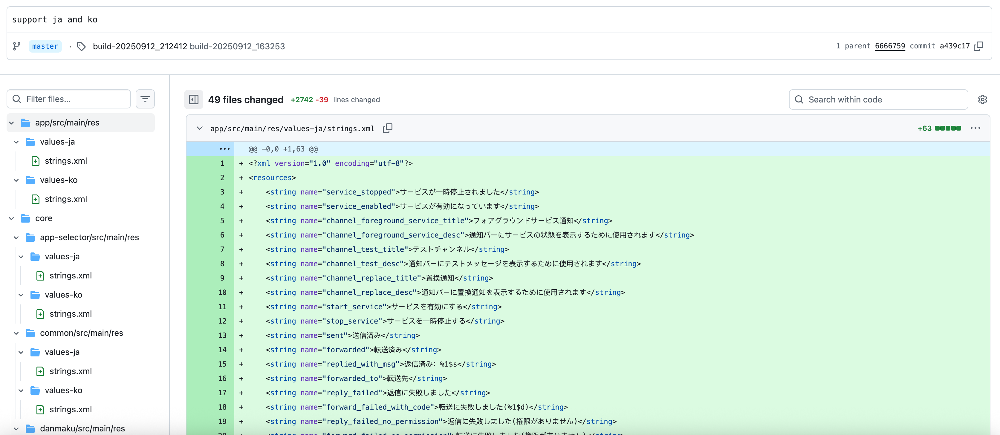
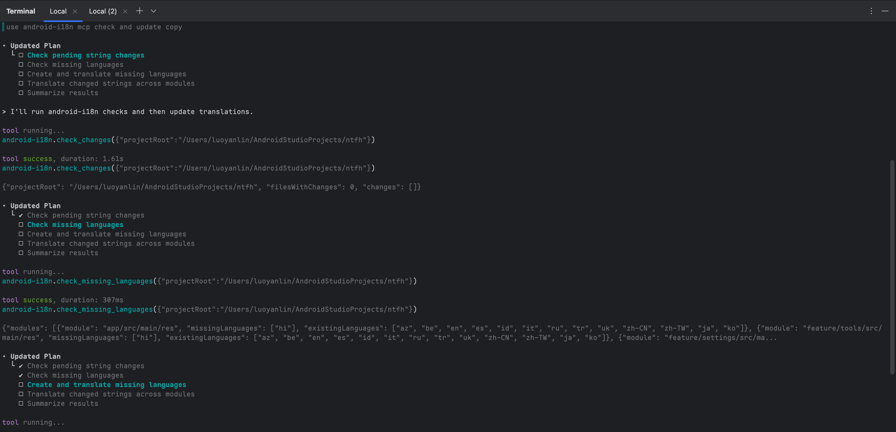

# Android i18n MCP Server

<div align="right">
  <a href="https://github.com/realskyrin/android-i18n-mcp/blob/main/README.md">English</a> | 
  <a href="https://github.com/realskyrin/android-i18n-mcp/blob/main/README-ZH.md">中文</a>
</div>

An MCP (Model Context Protocol) server that automatically translates Android app string resources to multiple languages by detecting changes in the default `strings.xml` files using Git diff.

📖 [Project Introduction Article](https://juejin.cn/post/7549032025673662514) (Chinese)

## Screenshots

<div align="center">
  
  <p><em>Generate multiple language files in one go, batch translation at scale for improved efficiency</em></p>
</div>

<div align="center">
  
  <p><em>MCP tool automatically detecting and translating missing languages</em></p>
</div>

## Features

- Automatically detects new or modified strings in default `strings.xml` files using Git diff
- Translates to up to 28 languages (configurable via environment variable)
- Preserves Android string formatting placeholders (%s, %d, %1$s, etc.)
- Supports multiple Android modules
- Batch translation for better performance
- Only translates changed strings to save API costs
- Configurable language selection to optimize API usage

## Supported Languages

The server supports translation to 28 languages. You can configure which languages to translate to using the `TRANSLATION_LANGUAGES` environment variable.

### All Supported Languages:

- `zh-CN` - Simplified Chinese (values-zh-rCN)
- `zh-TW` - Traditional Chinese Taiwan (values-zh-rTW)
- `zh-SG` - Traditional Chinese Singapore (values-zh-rSG)
- `zh-HK` - Traditional Chinese Hong Kong (values-zh-rHK)
- `zh-MO` - Traditional Chinese Macau (values-zh-rMO)
- `en` - English (values-en)
- `es` - Spanish (values-es)
- `hi` - Hindi (values-hi)
- `fr` - French (values-fr)
- `ar` - Arabic (values-ar)
- `bn` - Bengali (values-bn)
- `pt` - Portuguese (values-pt)
- `ru` - Russian (values-ru)
- `ur` - Urdu (values-ur)
- `id` - Indonesian (values-id)
- `de` - German (values-de)
- `ja` - Japanese (values-ja)
- `sw` - Swahili (values-sw)
- `mr` - Marathi (values-mr)
- `te` - Telugu (values-te)
- `tr` - Turkish (values-tr)
- `ko` - Korean (values-ko)
- `ta` - Tamil (values-ta)
- `vi` - Vietnamese (values-vi)
- `az` - Azerbaijani (values-az)
- `be` - Belarusian (values-be)
- `it` - Italian (values-it)
- `uk` - Ukrainian (values-uk)

## Installation

1. Clone the repository:
```bash
git clone <repository-url>
cd android-i18n-mcp
```

2. Install dependencies:
```bash
npm install
```

3. Build the project:
```bash
npm run build
```

4. Configure environment variables:
```bash
cp .env.example .env
```

Edit `.env` file with your configuration:
```env
ANDROID_PROJECT_ROOT=/path/to/your/android/project
TRANSLATION_PROVIDER=openai
TRANSLATION_API_KEY=your_api_key_here
# Optional:
TRANSLATION_API_BASE_URL=https://api.openai.com/v1
TRANSLATION_MODEL=gpt-4o-mini
# Comma-separated list of languages to translate (optional, defaults to all 28 languages)
TRANSLATION_LANGUAGES=zh-CN,es,fr,de,ja,ko
# Source language setting (optional, defaults to 'en'. If your default strings.xml uses another language like Chinese, set it to 'zh-CN')
TRANSLATOR_SOURCE_LANGUAGE=en
```

## MCP Configuration

### Add this server to your MCP client configuration (e.g., Cursor，Claude Desktop):

```json
{
  "mcpServers": {
    "android-i18n": {
      "command": "node",
      "args": ["/path/to/android-i18n-mcp/build/index.js"],
      "env": {
        "ANDROID_PROJECT_ROOT": "/path/to/your/android/project",
        "TRANSLATION_PROVIDER": "openai",
        "TRANSLATION_API_BASE_URL": "https://api.deepseek.com/v1",
        "TRANSLATION_API_KEY": "your_api_key_here",
        "TRANSLATION_LANGUAGES": "zh-CN,es,fr,de",  // Optional: specific languages
        "TRANSLATOR_SOURCE_LANGUAGE": "en"  // Optional: source language (default: en)
      }
    }
  }
}
```

### Codx Configuration Example

Add the following to your `codx.toml`:

```toml
[mcp_servers.android-i18n]
command = "node"
args = ["/path/to/android-i18n-mcp/build/index.js"]

[mcp_servers.android-i18n.env]
ANDROID_PROJECT_ROOT = "/path/to/android/project"
TRANSLATION_PROVIDER = "deepseek"
TRANSLATION_API_BASE_URL = "https://api.deepseek.com/v1"
TRANSLATION_API_KEY = "sk-xxxxxx"
TRANSLATION_MODEL = "deepseek-chat"
TRANSLATION_LANGUAGES = "zh-CN,es,fr,de,ja,ko"  # Optional: specific languages
TRANSLATOR_SOURCE_LANGUAGE = "en"  # Optional: source language (default: en)
```

## Agent Instruction

You can configure AGENTS.md or CLAUDE.md to have the Agent automatically call MCP when strings.xml files are modified:

```markdown
## Copy res update Guidelines
- Whenever a strings.xml file is modified, run android-i18n mcp to check and update copy.
```

## Available Tools

### 1. `translate_all_modules`
Detects changes in all default strings.xml files across all modules and translates them to all supported languages.

**Parameters:**
- `projectRoot` (optional): Android project root directory. Uses `ANDROID_PROJECT_ROOT` env var if not provided.

**Example:**
```json
{
  "tool": "translate_all_modules",
  "arguments": {
    "projectRoot": "/path/to/android/project"
  }
}
```

### 2. `translate_module`
Detects changes in a specific module's default strings.xml and translates to all languages.

**Parameters:**
- `modulePath` (required): Path to the Android module directory

**Example:**
```json
{
  "tool": "translate_module",
  "arguments": {
    "modulePath": "/path/to/android/project/app"
  }
}
```

### 3. `check_changes`
Checks for uncommitted changes in default strings.xml files without performing translation.

**Parameters:**
- `projectRoot` (optional): Android project root directory

**Example:**
```json
{
  "tool": "check_changes",
  "arguments": {
    "projectRoot": "/path/to/android/project"
  }
}
```

### 4. `check_missing_languages`
Checks which language directories are missing compared to the configured TRANSLATION_LANGUAGES environment variable.

**Parameters:**
- `projectRoot` (optional): Android project root directory

**Example:**
```json
{
  "tool": "check_missing_languages",
  "arguments": {
    "projectRoot": "/path/to/android/project"
  }
}
```

### 5. `create_and_translate_missing_languages`
Creates missing language directories and translates the default strings.xml into them for all configured languages.

**Parameters:**
- `projectRoot` (optional): Android project root directory

**Example:**
```json
{
  "tool": "create_and_translate_missing_languages",
  "arguments": {
    "projectRoot": "/path/to/android/project"
  }
}
```

## How It Works

1. **Change Detection**: The server uses Git diff to detect which strings have been added or modified in the default `values/strings.xml` files since the last commit.

2. **Batch Translation**: Changed strings are translated in batches to the target language using the configured AI translation API.

3. **XML Merging**: Translated strings are merged into the existing language-specific `strings.xml` files, preserving existing translations and only updating changed ones.

4. **Module Support**: The server can process multiple Android modules in a single operation, detecting all `strings.xml` files matching the pattern `**/src/main/res/values/strings.xml`.

## Translation Providers

Currently supported:
- **OpenAI** (including OpenAI-compatible APIs)
- **DeepSeek** (automatically uses api.deepseek.com endpoint)

Planned support:
- Anthropic Claude
- Google Translate

### DeepSeek Configuration Example:
```env
TRANSLATION_PROVIDER=deepseek
TRANSLATION_API_KEY=your_deepseek_api_key
# Optional: defaults to deepseek-chat
TRANSLATION_MODEL=deepseek-chat
# Optional: specific languages to translate (defaults to all 28)
TRANSLATION_LANGUAGES=zh-CN,en,es,fr,de,ja,ko
# Optional: source language (defaults to 'en')
TRANSLATOR_SOURCE_LANGUAGE=en
```

## Configuration Options

### Language Selection

You can configure which languages to translate to using the `TRANSLATION_LANGUAGES` environment variable:

- **Translate to all 28 supported languages (default):**
  ```env
  # Don't set TRANSLATION_LANGUAGES or leave it empty
  ```

- **Translate to specific languages only:**
  ```env
  TRANSLATION_LANGUAGES=zh-CN,es,fr,de,ja,ko
  ```

- **Single language:**
  ```env
  TRANSLATION_LANGUAGES=zh-CN
  ```

**Note:** If you specify languages that are not supported, the server will:
1. Show a warning listing the unsupported languages
2. Display all supported languages for reference
3. Continue with only the valid languages from your configuration

### Source Language Configuration

By default, the server assumes your default `values/strings.xml` file uses English (`en`). If your project uses a different language as the default (e.g., Chinese), you need to configure the source language:

**Scenario 1: Default strings.xml uses English (no configuration needed)**
```env
# Don't set TRANSLATOR_SOURCE_LANGUAGE, defaults to 'en'
```

**Scenario 2: Default strings.xml uses Chinese**
```env
TRANSLATOR_SOURCE_LANGUAGE=zh-CN
```

**Scenario 3: Using other languages as default**
```env
# Any supported language code
TRANSLATOR_SOURCE_LANGUAGE=es  # Spanish
TRANSLATOR_SOURCE_LANGUAGE=fr  # French
TRANSLATOR_SOURCE_LANGUAGE=ja  # Japanese
# etc...
```

**Important Notes:**
- Correct source language configuration ensures translation quality and accuracy
- Incorrect source language configuration may lead to translation failures or incorrect results
- When the target language matches the source language, text will be copied directly without translation
- Translation validation logic automatically adjusts based on the source language to avoid false untranslated warnings

## Development

Run in development mode with hot reload:
```bash
npm run dev
```

Build the project:
```bash
npm run build
```

## Project Structure

```
android-i18n-mcp/
├── src/
│   ├── index.ts           # MCP server entry point
│   ├── xmlParser.ts       # Android strings.xml parsing
│   ├── gitDiff.ts         # Git diff analysis
│   ├── translator.ts      # Translation API integration
│   └── translationManager.ts # Translation orchestration
├── package.json
├── tsconfig.json
├── .env.example
└── README.md
```

## Notes

- The server only translates strings that have `translatable` attribute not set to `false`
- Deleted strings are automatically removed from translated files
- Translation preserves Android formatting placeholders
- All file operations are atomic - if translation fails for any language, no files are modified

## License

MIT